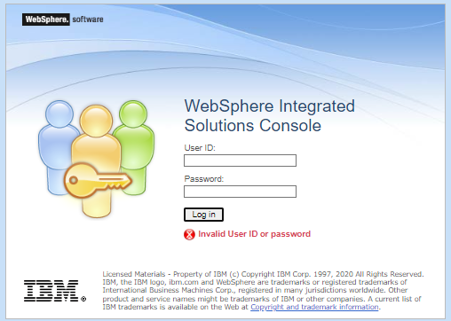

# sample.loginmodule

This repository contains a class that serves as an implementation of the custom login module. This project aims to create a sample login module jar file that is compatible with the following runtimes:
- Open Liberty
- WebSphere Liberty
- WebSphere Application Server traditional 


## How to create a sample custom loginModule jar 

`1.` Update the following file.  
Make the necessary modifications to the SampleTAI.java file to reflect the desired behavior. This may involve implementing specific methods, modifying existing functionality, or adding additional logic as required. 
```
./src/main/java/com/ibm/ws/samples/lm/SampleLoginModule.java
```
`2.` Ensure that you have Maven installed on your system. If not, you can download it from the official Maven website and follow the installation instructions. Open a terminal or command prompt and navigate to the root directory of your project where the pom.xml file is located. Run the following command to build and package the project using Maven:
```
mvn package
```
`3.` After the build process completes successfully, the JAR file will be created in the target directory of your project.
```
./target/samplelm-1.0-SNAPSHOT.jar
```

## How to configure the custom loginModule jar 

The following articles provide instructions on how to configure the JAR file for the WebSphere runtimes. 

- [WebSphere Liberty or OpenLiberty](TO BE UPDATED)
- [WebSphere Application Server traditional](https://www.ibm.com/docs/en/was/8.5.5?topic=SSEQTP_8.5.5/com.ibm.websphere.nd.multiplatform.doc/ae/tsec_jaascustlogmod.htm) 

## Experiment - Allow "Admin1" to run wsadmin command but deny WebSphere AdminConsole access 

### Steps
- Compile the sample login module 
- Place the login module under lib\ext
    ```
    C:\WAS90ND\lib\ext>dir
    Volume in drive C is Windows
     Volume Serial Number is 90DE-E494

    Directory of C:\WAS90ND\lib\ext

    08/03/2023  02:14 PM    <DIR>          .
    04/25/2023  12:53 PM    <DIR>          ..
    08/03/2023  02:59 PM             3,902 samplelm-1.0-SNAPSHOT.jar
                   1 File(s)          3,902 bytes
                   2 Dir(s)  79,673,016,320 bytes free
    ```
- Configure the loginModule under System.WEB_INBOUND from the AdminConsole
    ```
    Global security (Java Authentication and Authorization Service)> JAAS - System logins > WEB_INBOUND 

    com.ibm.ws.security.server.lm.ltpaLoginModule
    REQUIRED  
    1  
    com.ibm.ws.security.server.lm.wsMapDefaultInboundLoginModule
    REQUIRED  
    2  
    com.ibm.ws.samples.lm.SampleLoginModule
    REQUIRED  
    3  
    ```
- Start the server

### Results

Tested on WebSphere traditional 9.0.5.14. 

- The user "Admin1" can run the wsadmin command
    ```
    C:\WAS90ND\profiles\AppSrv01\bin>wsadmin -username Admin1 -password Admin1
    WASX7209I: Connected to process "server1" on node DESKTOP-BBBKTCUNode02 using SOAP connector;  The type of process is: UnManagedProcess
    WASX7031I: For help, enter: "print Help.help()"
    wsadmin>$AdminTask listProtocols
    TLSv1.3
    TLSv1.2
    TLSv1.1
    TLSv1
    ```
- "Admin1" is not able to login to the AdminConsole
- Screenshot when Admin1 tries to login

 

- SystemOut.log output 
   ```
    [8/3/23 15:34:33:241 EDT] 000000af SystemOut     O username=Admin1 password=[C@64aa9921
    [8/3/23 15:34:33:241 EDT] 000000af SystemOut     O DEBUG: Admin1 is trying to login. Make login fail

    [8/3/23 15:34:33:242 EDT] 000000af SystemOut     O -- Error Stack ---
    javax.security.auth.login.LoginException: Login failed for user:Admin1
	at com.ibm.ws.samples.lm.SampleLoginModule.login(SampleLoginModule.java:58)
	at sun.reflect.NativeMethodAccessorImpl.invoke0(Native Method)
	at sun.reflect.NativeMethodAccessorImpl.invoke(NativeMethodAccessorImpl.java:90)
	at sun.reflect.DelegatingMethodAccessorImpl.invoke(DelegatingMethodAccessorImpl.java:55)
	at java.lang.reflect.Method.invoke(Method.java:508)
	at javax.security.auth.login.LoginContext.invoke(LoginContext.java:788)
	at javax.security.auth.login.LoginContext.access$000(LoginContext.java:196)
	at javax.security.auth.login.LoginContext$4.run(LoginContext.java:698)
	at javax.security.auth.login.LoginContext$4.run(LoginContext.java:696)
	at java.security.AccessController.doPrivileged(AccessController.java:747)
	at javax.security.auth.login.LoginContext.invokePriv(LoginContext.java:696)
	at javax.security.auth.login.LoginContext.login(LoginContext.java:597)
	at com.ibm.ws.security.auth.JaasLoginHelper.jaas_login(JaasLoginHelper.java:491)
	at com.ibm.ws.security.auth.ContextManagerImpl.login(ContextManagerImpl.java:4947)
	at com.ibm.ws.security.auth.ContextManagerImpl.login(ContextManagerImpl.java:4542)
	at com.ibm.ws.security.auth.ContextManagerImpl.login(ContextManagerImpl.java:4538)
	at com.ibm.ws.security.web.FormLoginExtensionProcessor$1.run(FormLoginExtensionProcessor.java:607)
	at com.ibm.ws.security.util.AccessController.doPrivileged(AccessController.java:118)
	at com.ibm.ws.security.web.FormLoginExtensionProcessor.formLogin(FormLoginExtensionProcessor.java:618)
	at com.ibm.ws.security.web.FormLoginExtensionProcessor.formLogin(FormLoginExtensionProcessor.java:260)
	at com.ibm.ws.security.web.FormLoginExtensionProcessor.handleRequest(FormLoginExtensionProcessor.java:238)
	at com.ibm.ws.webcontainer.filter.WebAppFilterChain.invokeTarget(WebAppFilterChain.java:143)
	at com.ibm.ws.webcontainer.filter.WebAppFilterChain.doFilter(WebAppFilterChain.java:96)
	at com.ibm.isclite.servlet.SessionFilter.doFilter(SessionFilter.java:112)
	at com.ibm.ws.webcontainer.filter.FilterInstanceWrapper.doFilter(FilterInstanceWrapper.java:197)
	at com.ibm.ws.webcontainer.filter.WebAppFilterChain.doFilter(WebAppFilterChain.java:90)
	at com.ibm.ws.console.core.servlet.WSCUrlFilter.doFilter(WSCUrlFilter.java:148)
	at com.ibm.ws.webcontainer.filter.FilterInstanceWrapper.doFilter(FilterInstanceWrapper.java:197)
	at com.ibm.ws.webcontainer.filter.WebAppFilterChain.doFilter(WebAppFilterChain.java:90)
	at com.ibm.ws.webcontainer.filter.WebAppFilterManager.doFilter(WebAppFilterManager.java:979)
	at com.ibm.ws.webcontainer.filter.WebAppFilterManager.invokeFilters(WebAppFilterManager.java:1119)
	at com.ibm.ws.webcontainer.webapp.WebApp.handleRequest(WebApp.java:4164)
	at com.ibm.ws.webcontainer.webapp.WebAppImpl.handleRequest(WebAppImpl.java:2210)
	at com.ibm.ws.webcontainer.webapp.WebGroup.handleRequest(WebGroup.java:304)
	at com.ibm.ws.webcontainer.WebContainer.handleRequest(WebContainer.java:1033)
	at com.ibm.ws.webcontainer.WSWebContainer.handleRequest(WSWebContainer.java:1817)
	at com.ibm.ws.webcontainer.channel.WCChannelLink.ready(WCChannelLink.java:382)
	at com.ibm.ws.http.channel.inbound.impl.HttpInboundLink.handleDiscrimination(HttpInboundLink.java:465)
	at com.ibm.ws.http.channel.inbound.impl.HttpInboundLink.handleNewRequest(HttpInboundLink.java:532)
	at com.ibm.ws.http.channel.inbound.impl.HttpInboundLink.processRequest(HttpInboundLink.java:318)
	at com.ibm.ws.http.channel.inbound.impl.HttpICLReadCallback.complete(HttpICLReadCallback.java:88)
	at com.ibm.ws.ssl.channel.impl.SSLReadServiceContext$SSLReadCompletedCallback.complete(SSLReadServiceContext.java:1833)
	at com.ibm.ws.tcp.channel.impl.AioReadCompletionListener.futureCompleted(AioReadCompletionListener.java:175)
	at com.ibm.io.async.AbstractAsyncFuture.invokeCallback(AbstractAsyncFuture.java:217)
	at com.ibm.io.async.AsyncChannelFuture.fireCompletionActions(AsyncChannelFuture.java:161)
	at com.ibm.io.async.AsyncFuture.completed(AsyncFuture.java:138)
	at com.ibm.io.async.ResultHandler.complete(ResultHandler.java:204)
	at com.ibm.io.async.ResultHandler.runEventProcessingLoop(ResultHandler.java:775)
	at com.ibm.io.async.ResultHandler$2.run(ResultHandler.java:905)
	at com.ibm.ws.util.ThreadPool$Worker.run(ThreadPool.java:1909)
    --- END Error Stack ---

    [8/3/23 15:34:33:247 EDT] 000000af SystemOut     O DEBUG: abort = true 


### Limitation

System.WEB_INBOUND login module can be called not only for AdminConsole but also by applications. I have not been able to figure out what application the loginModule is being called for. If username is created in a certain naming convention for AdminConsole, this simple loginModule may work. 

The loginModule is for evaluation only. Not for the production use. 

## Contributing 
Pull requests are welcome. For major changes, please open an issue first to discuss what you would like to change. 

## License
Unless otherwise noted in a script:<br/>
[](https://www.apache.org/licenses/LICENSE-2.0)
